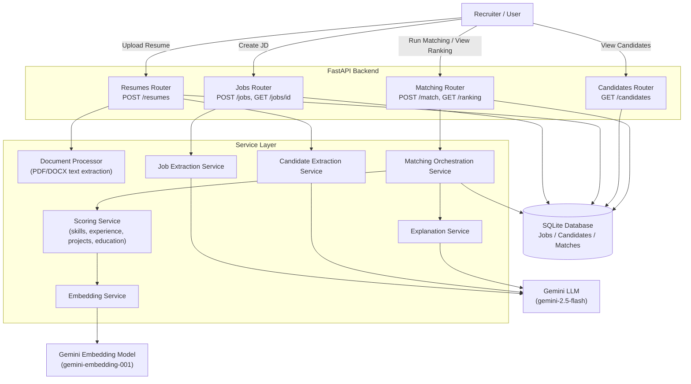

# AI Recruitment & Candidate Matching Platform

An AI-powered recruitment platform that analyzes Job Descriptions and candidate resumes,
extracts structured information, semantically matches candidates against job requirements,
scores and ranks them, identifies skill gaps, and generates AI explanations of candidate suitability.

## 1. Project Overview

Recruiters often receive large volumes of resumes for a single opening and manually comparing
every candidate against a Job Description is slow and inconsistent. This platform automates the
initial screening step: it understands both the JD and each resume using an LLM, compares them
using semantic (embedding-based) matching — not just keyword matching — and produces a ranked,
explainable shortlist for the recruiter to review.

## 2. Problem Statement

Manual resume screening does not scale with applicant volume, is inconsistent between reviewers,
and struggles to recognize relevant experience when it's described in different words than the
job posting uses (e.g. "Developed REST APIs using Python and FastAPI" vs. a requirement for
"Python backend development experience"). This system solves that by combining LLM-based
extraction with embedding-based semantic comparison.

## 3. Objectives

- Extract structured requirements from a Job Description using an LLM
- Extract structured candidate profiles from resumes (PDF/DOCX) using an LLM
- Semantically match candidates against job requirements (not just keyword matching)
- Score candidates using a transparent, weighted methodology
- Rank candidates by match score
- Identify matching and missing skills per candidate
- Generate a natural-language AI explanation of each candidate's fit
- Handle document/LLM/embedding failures gracefully with meaningful errors

## 4. Features

- Job Description upload with automatic requirement extraction
- Resume upload (PDF/DOCX) with automatic profile extraction
- Semantic skill matching (exact match + embedding similarity fallback)
- Weighted, configurable candidate scoring across 5 categories
- Candidate ranking per job
- Matching/missing skill gap analysis
- AI-generated, data-grounded suitability explanations
- Batch-resilient matching (one candidate's failure doesn't block others)
- Structured error handling for every documented failure mode

## 5. Technology Stack

| Layer | Technology | Why |
|---|---|---|
| Backend Framework | FastAPI | Async-ready, auto-generated OpenAPI docs, strong typing via Pydantic |
| Database | SQLite + SQLAlchemy ORM | Zero-setup for a 3-week project, easily swappable for Postgres later |
| LLM | Google Gemini (`gemini-3.5-flash`) via `google-genai` SDK | Native structured-output support, fast, cost-effective |
| Embeddings | Google Gemini (`gemini-embedding-001`) | Same provider as LLM, simplifies API key/config management |
| Document Parsing | `pypdf`, `python-docx` | Industry-standard libraries for PDF/DOCX text extraction |
| Config Management | `pydantic-settings` + `.env` | Type-safe config, no hardcoded secrets |
| Testing | `pytest`, `httpx`, `unittest.mock` | Mocked LLM/embedding calls for fast, deterministic, quota-free tests |

## 6. System Architecture

## 7. Application Workflow

1. Recruiter submits a Job Description via `POST /jobs`
2. LLM extracts required skills, preferred skills, minimum experience, and education requirement
3. Recruiter uploads candidate resumes via `POST /resumes` (linked to a `job_id`)
4. Document processor extracts raw text (PDF/DOCX); LLM extracts a structured candidate profile
5. Recruiter triggers `POST /match?job_id=...` to score every candidate for that job
6. For each candidate: skills are semantically matched, experience/projects/education are scored,
   a weighted final score is computed, and an AI explanation is generated
7. Recruiter calls `GET /ranking?job_id=...` to view candidates sorted by match score, with
   matching/missing skills visible per candidate

## 8. Resume Processing Approach

Resumes are accepted as PDF or DOCX. Text is extracted using `pypdf` (PDF) or `python-docx`
(DOCX) behind a single `extract_text()` entry point, which validates the file extension, checks
for empty/corrupted content, and raises typed exceptions (`UnsupportedFileFormatError`,
`EmptyDocumentError`, `CorruptedDocumentError`) rather than crashing. The extracted raw text is
then passed to the LLM for structured profile extraction (name, skills, experience, education,
projects, certifications), using Gemini's native structured-output mode against a Pydantic schema.

## 9. LLM Usage

Gemini (`gemini-3.5-flash`) is used in three distinct places, each with a purpose-built prompt:

1. **Job requirement extraction** — converts free-text JDs into structured required/preferred
   skills, minimum experience, and education requirements. Temperature `0.1` for consistency.
2. **Candidate profile extraction** — converts free-text resumes into structured profiles,
   including estimating total experience from work-history dates when not explicitly stated.
   Temperature `0.1`.
3. **Match explanation generation** — writes a short, factual explanation grounded in the
   *already-computed* scores and matching/missing skills (the LLM explains results our own
   scoring engine produced; it does not perform the matching itself). Temperature `0.4`
   (slightly higher, since output is prose meant for a human reader, not literal data).

All extraction calls use Gemini's structured output feature (`response_schema`) rather than
prompting for JSON and parsing it manually — this guarantees schema-conformant output instead
of relying on the model "behaving."

## 10. Embedding Approach

Gemini's `gemini-embedding-001` model is used to generate vector embeddings for skills,
education strings, and project/experience text. Similarity between two embeddings is measured
using cosine similarity. Embeddings are only called when needed — skill comparisons first try a
cheap exact/substring match (handles cases like "React" vs "ReactJS") and only fall back to
embedding similarity for skills that don't share text overlap, balancing cost and accuracy.

## 11. Matching Methodology

For each required skill in the JD, the system checks whether any candidate skill satisfies it —
first via exact/substring match, then via embedding cosine similarity (threshold: `0.72`). This
is what allows "Python backend development experience" (JD) to match "Developed REST APIs using
Python and FastAPI" (resume) even without shared keywords. The same approach is used for
education matching (with separate strong-match / partial-match thresholds) and for comparing a
candidate's overall project/experience text against the full job description.

## 12. Scoring Methodology

Final score is a weighted sum across five categories, each computed as a 0-1 score and combined:

| Category | Weight | How it's computed |
|---|---|---|
| Required Skills | 40% | Fraction of required skills matched (exact or semantic) |
| Relevant Experience | 25% | `candidate_years / required_years`, capped at 1.0 |
| Projects | 20% | Embedding similarity between JD and candidate projects/experience, rescaled |
| Education | 10% | Embedding similarity between required and candidate education, tiered (1.0 / 0.6 / 0.0) |
| Additional (Preferred) Skills | 5% | Fraction of preferred/nice-to-have skills matched |

Weights are configurable via `app/config.py` (`Settings` class), not hardcoded inline, so they
can be tuned without touching the scoring logic itself.

## 13. API Documentation

Full interactive documentation is auto-generated by FastAPI at `/docs` (Swagger UI) once the
server is running. Key endpoints:

| Method | Endpoint | Purpose |
|---|---|---|
| POST | `/jobs` | Create a job, auto-extracts requirements via LLM |
| GET | `/jobs/{job_id}` | Retrieve a job |
| POST | `/resumes` | Upload a resume (multipart: `job_id` + `file`), auto-extracts profile |
| GET | `/candidates` | List candidates, optionally filtered by `job_id` |
| GET | `/candidates/{candidate_id}` | Retrieve one candidate |
| POST | `/match?job_id=` | Score all candidates for a job |
| GET | `/ranking?job_id=` | Get candidates ranked by match score |
| GET | `/health` | Health check |

## 14. Installation

\`\`\`bash
git clone https://github.com/Shreyaakatiyar/AI_Recruitment_Platform
cd ai-recruitment-platform
python -m venv venv
source venv/bin/activate   # Windows: venv\\Scripts\\activate
pip install -r requirements.txt
pip install -r requirements-dev.txt   # for running tests
\`\`\`

## 15. Environment Variables

Copy `.env.example` to `.env` and fill in your key:

\`\`\`
GEMINI_API_KEY=your_gemini_api_key_here
DATABASE_URL=sqlite:///./recruitment.db
APP_ENV=development
\`\`\`

## 16. Running Instructions

\`\`\`bash
uvicorn app.main:app --reload
\`\`\`

Then open **http://127.0.0.1:8000/docs** for the interactive API.

## 17. Testing

\`\`\`bash
pytest tests/ -v
\`\`\`

All tests use a fully isolated test database and mock every Gemini API call. Test scenarios covered include: valid job/resume creation,
invalid input (too-short JD), LLM failure (502), unsupported file format (400), missing job
(404), no candidates to match (400), and ranking requested before matching has run (404).

## 18. Error Handling

| Scenario | HTTP Status | Handling |
|---|---|---|
| Unsupported file format | 400 | `UnsupportedFileFormatError` |
| Empty document | 400 | `EmptyDocumentError` |
| Corrupted document | 400 | `CorruptedDocumentError` |
| Missing Job Description / invalid input | 422 | Pydantic validation |
| Missing job / candidate | 404 | Explicit existence checks |
| LLM API failure | 502 | `LLMServiceError` |
| Embedding failure | 502 | `EmbeddingServiceError` |
| One candidate fails during batch matching | 200 (partial) | Per-candidate try/except; other candidates still succeed, failures reported separately |
| Any unanticipated exception | 500 | Global exception handler, logs server-side, returns generic safe message |

## 19. Known Limitations

- Embedding-based matching relies on a fixed similarity threshold (`0.72`) rather than a
  learned/calibrated one — this works well in testing but isn't formally tuned against a
  labeled dataset.
- Experience is estimated by the LLM from resume text when not explicitly stated, which can be
  imprecise for non-standard resume formats.
- Single-user system with no authentication — not production-ready for multi-recruiter use.
- SQLite is used for simplicity; would need to migrate to Postgres for concurrent/production use.
